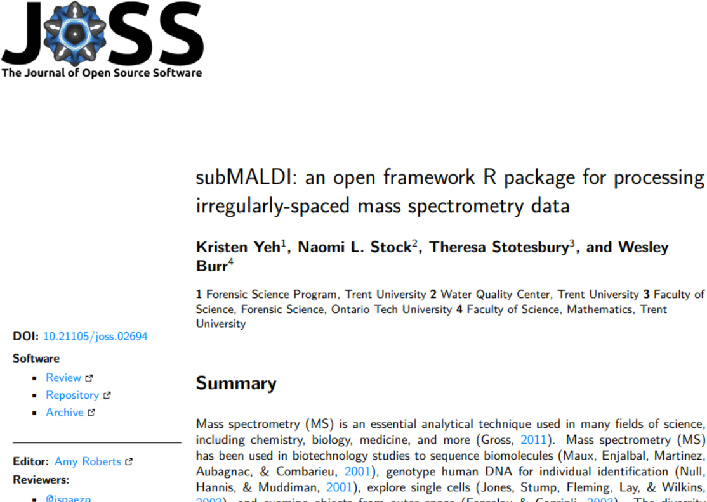
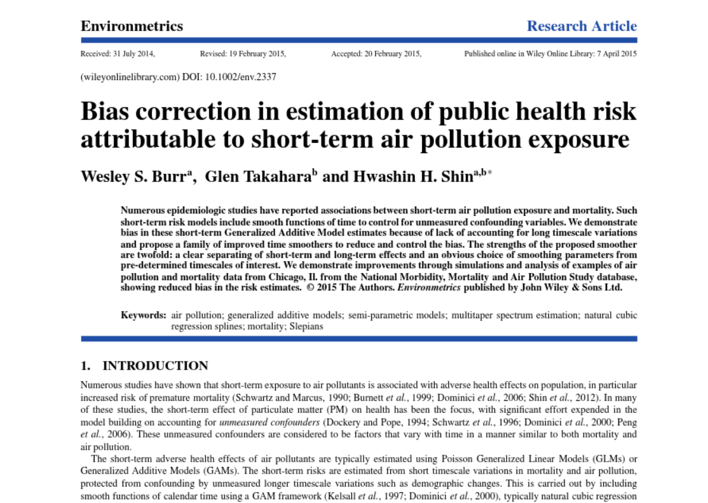
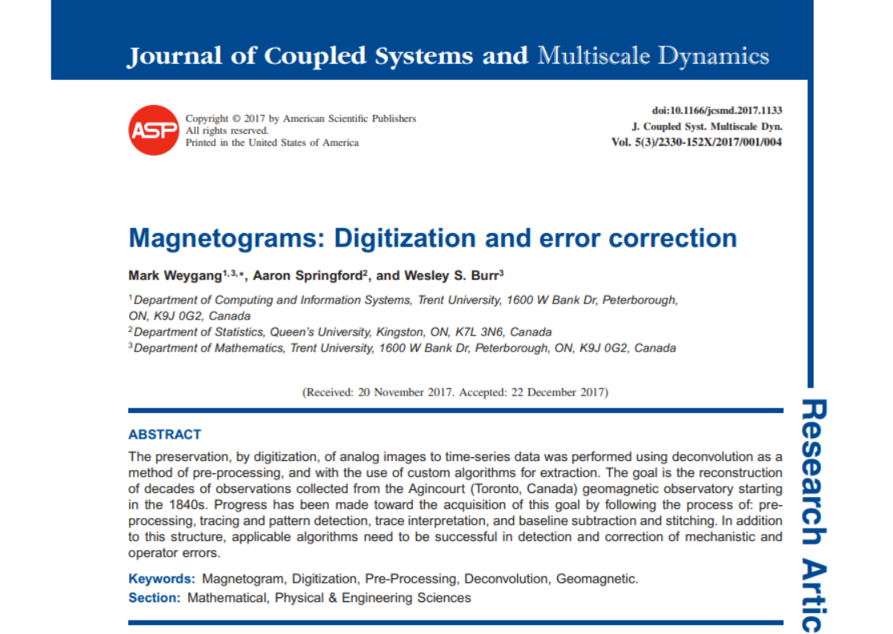

class: inverse

```{r include=FALSE}
library(ggplot2)
filter <- dplyr::filter
knitr::opts_chunk$set(warning=FALSE, message=FALSE, fig.width=10.5, fig.height=4, 
  comment=NA, rows.print=16)
theme_set(theme_gray(base_size = 24))
```

## A Brief History

* undergraduate degree in engineering (communications, speciality in applied math)
* Masters in applied math (signal processing) 
* PhD in statistics (statistical signal processing and time series analysis)
* NSERC Canadian Government Laboratories Visiting Fellow (postdoc, Health Canada)
* Trent University, 2016-present

---

class: inverse

## A Brief History

* started working on signal processing in communications
* did a pair of NSERC USRAs (summers of 2004 and 2005)
* decided I liked this stuff $\Rightarrow$ Masters
* just kept going ...
* ended up in applied statistics

---

class: inverse

## Fields I've Worked in, Chronologically to 2016

* communications and signal processing
* space physics
* communications again (from different perspective)

---

class: inverse

## Fields I've Worked in, Chronologically to 2016 
* communications and signal processing
* space physics
* communications again (from different perspective)
* **time series analysis, spectrum estimation**
* **geophysics**

---

class: inverse

## Fields I've Worked in, Chronologically to 2016

* communications and signal processing
* space physics
* communications again (from different perspective)
* time series analysis, spectrum estimation
* geophysics
* **computational statistics**
* **environmental epidemiology (into postdoc)**

---

class: inverse

## Fields I've Worked in, Chronologically since 2016

* theoretical and applied statistics, computational statistics (ongoing)
* environmental epidemiology
* geophysics

---

class: inverse

## Fields I've Worked in, Chronologically since 2016

* theoretical and applied statistics, computational statistics (ongoing)
* environmental epidemiology
* geophysics
* **agronomy**
* **environmental science**

---

class: inverse

## Fields I've Worked in, Chronologically since 2016

* theoretical and applied statistics, computational statistics (ongoing)
* environmental epidemiology
* geophysics
* agronomy
* environmental science
* **statistics education**
* **cognition and psychology**
* **biology**

---

class: inverse

## Fields I've Worked in, Chronologically since 2016

* theoretical and applied statistics, computational statistics (ongoing)
* environmental epidemiology
* geophysics
* agronomy
* environmental science
* statistics education
* cognition and psychology
* biology
* **Forensic Science** (jury trial analysis, some random stuff with undergrads)
* **[Stuff Theresa does]**
* **geophysics**

---

class: inverse

## Graduate Supervision

Since 2016, I've supervised or co-supervised 10 Masters students, on topics:

* applied geophysics and computational statistics
* environmental epidemiology and Bayesian models

---

class: inverse

## Graduate Supervision

Since 2016, I've supervised or co-supervised 10 Masters students, on topics:

* applied geophysics and computational statistics
* environmental epidemiology and Bayesian models
* **cognition, applied psychology, user interface design for mathematics software (x2)**

---

class: inverse

## Graduate Supervision

Since 2016, I've supervised or co-supervised 10 Masters students, on topics:

* applied geophysics and computational statistics
* environmental epidemiology and Bayesian models
* cognition, applied psychology, user interface design for mathematics software (x2)
* **DNA testing and probabilistic models**
* **interpolators and applied statistics**

(all at Trent)

---

class: inverse

## Graduate Supervision

Since 2016, I've supervised or co-supervised 10 Masters students, on topics:

* applied geophysics and computational statistics
* environmental epidemiology and Bayesian models
* cognition, applied psychology, user interface design for mathematics software (x2)
* DNA testing and probabilistic models
* interpolators and applied statistics 
* **statistical tests for the detection of signals (x2)** (Queen's)
* **time series clustering** (Queen's)
* **statistical structure of time series regression models** (Queen's)

---

class: inverse

## Graduate Supervision

... with another 3 Masters students ongoing (at Trent), and 1 PhD (with another starting in
January, with Theresa, we hope!)

---

class: inverse

## Research Highlights

<center>

</center>

---

class: inverse

## Research Highlights

<center>

</center>

---

class: inverse

## Research Highlights

<center>

</center>

---

class: inverse

## Current Open Research Projects

1. **Theoretical spectrum estimation work** (with G.~Takahara of Queen's, and our student S. Griffith)


---

class: inverse

## Current Open Research Projects

1. Theoretical spectrum estimation work (with G.~Takahara of Queen's, and our student S. Griffith)

2. **Environmental Epidemiology** (with H.H.~Shin of Health Canada, and students C. Smith, S. Jarvis and K. Sun)


---

class: inverse

## Current Open Research Projects

1. Theoretical spectrum estimation work (with G.~Takahara of Queen's, and our student S. Griffith)

2. Environmental Epidemiology (with H.H.~Shin of Health Canada, and students C. Smith, S. Jarvis and K. Sun)

3. **Mass Spectrometry** spectra and statistics tests (with T. Stotesbury and N. Stock, and student A. Orr)


---

class: inverse

## Current Open Research Projects

1. Theoretical spectrum estimation work (with G.~Takahara of Queen's, and our student S. Griffith)

2. Environmental Epidemiology (with H.H.~Shin of Health Canada, and students C. Smith, S. Jarvis and K. Sun)

3. Mass Spectrometry spectra and statistics tests (with T. Stotesbury and N. Stock, and student A. Orr)

4. **Magnetic Field** historical data set reconstruction (with student B. Ott, and NRCan Geomag Lab)


---

class: inverse

## Current Open Research Projects

1. Theoretical spectrum estimation work (with G.~Takahara of Queen's, and our student S. Griffith)

2. Environmental Epidemiology (with H.H.~Shin of Health Canada, and students C. Smith, S. Jarvis and K. Sun)

3. Mass Spectrometry spectra and statistics tests (with T. Stotesbury and N. Stock, and student A. Orr)

4. Magnetic Field historical data set reconstruction (with student B. Ott, and NRCan Geomag Lab)

5. (NEW) **Biomaterial aging and inverse time models** (with T. Stotesbury, and hopefully N. Stock and student S. Castel)


---

layout: false
class: inverse, middle

<center>
<a href="http://www.trentu.ca/math/"></a> &emsp;&emsp;
<a href="https://creativecommons.org/licenses/by/4.0/"></a>
</center>

## If you're interested in collaborating, let me know - I'm always interested in doing something new if it involves cool data or interesting applied statistical problems

- Contact me: [Email](mailto:wesleyburr@trentu.ca) or [Twitter](https://twitter.com/wsburr)
- Slides created via the R package [xaringan](https://github.com/yihui/xaringan) by Yihui Xie
- Slides and source at <http://bit.ly/burr_promo_2020>

<br/>
